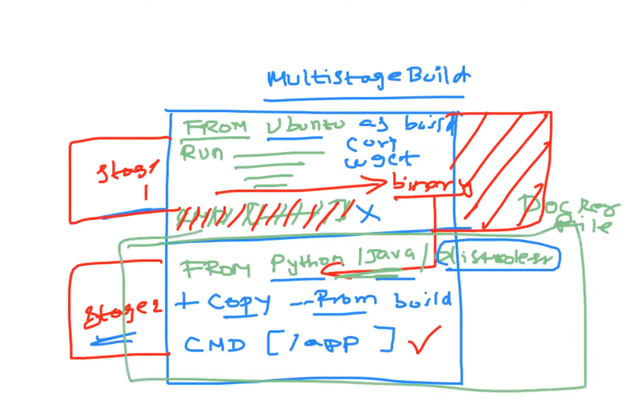
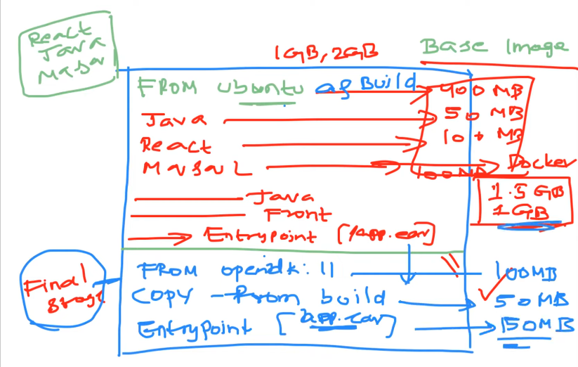
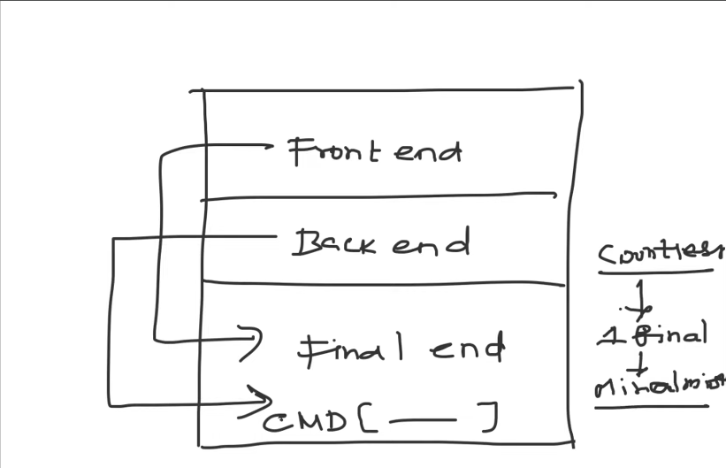
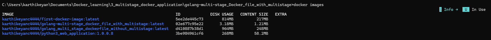

# Multi Stage Docker Build

The main purpose of choosing a golang based applciation to demostrate this example is golang is a statically-typed programming language that does not require a runtime in the traditional sense. Unlike dynamically-typed languages like Python, Ruby, and JavaScript, which rely on a runtime environment to execute their code, Go compiles directly to machine code, which can then be executed directly by the operating system.

So the real advantage of multi stage docker build and distro less images can be understand with a drastic decrease in the Image size.

## Reffer attached notes below

1. **Advantages of Distroless Images compared to Normal Images**
    - 🔒 Reduced attack surface – only required app + libraries, nothing extra
    - 🚫 No shell access – prevents attackers from running commands
    - 🛡️ Fewer vulnerabilities (CVEs) – minimal components = less risk
    - ❌ No package managers/tools – removes common attack entry points
    - 📊 Improved security & compliance – easier to scan and audit
    - 📦 Smaller image size – faster downloads and deployments
    - 🔧 Less maintenance – fewer components to update and patch
    - 🧱 Immutable by design – prevents changes inside running container
    - 🚷 Limits attacker movement – no debugging or network tools available
    - ⚡ Faster security scanning – minimal content makes scanning quickerReduced attack surface – only required app + libraries, nothing extra

 2. Important Note While Building the Docker Image

    - **Docker image names must be lowercase; uppercase letters are not allowed.**
    - **❌ Invalid (will fail)**
        - `docker build -t MyApp/Image:latest .`
    - **✅ Valid (works)**
        - `docker build -t myapp/image:latest .`

 3. Image Size Comparison (Multi-stage vs Normal Build)
    - You can clearly see the size difference between a normal Docker image and a multi-stage build.
    - Multi-stage builds significantly reduce image size (e.g., **800MB → 3.5MB**).
    - This makes containers more efficient, secure, and faster to deploy.
    - **Multi-stage builds represent the future of optimized container images.**

 4. Where to see these distroless image?
    - **Please check below two links for distroless images**
    - [GitHub Repo for Multi Stage Builds](https://www.youtube.com/redirect?event=video_description&redir_token=QUFFLUhqbS1wNUYtUF8xUGpjRUdFMWh5WnktVkdNd2oyUXxBQ3Jtc0ttU3A2N1NNOGl5WE5wV1hwcFJOTWhUZFRSR1lUYmJ1a3ZwN1Q4VGcxNnZXaUVUVjhRMUNDV2YxeGhXNDZ4cHhFVndtb0lTamFmRk5ZeUJRV2N3SUh0bDN5ZExvbDZKSkR1SjZDalBfM1VXdDM5QWtrbw&q=https%3A%2F%2Fgithub.com%2Fiam-veeramalla%2FDocker-Zero-to-Hero%2Ftree%2Fmain%2Fexamples%2Fgolang-multi-stage-docker-build&v=yyJrZgoNal0)
    - [More Distroless Images eg: Java, Python e.t.c.,.](https://www.youtube.com/redirect?event=video_description&redir_token=QUFFLUhqbDl4dVZRX2hFdXpyR191WGJfdmpHNUJoU1ZPQXxBQ3Jtc0ttdFZCbEJCMVFOWmE3dFdrU0g4bjFiS3F3VG80Vm1CX1N4Ny1kLV82VThlaUFLTlpqdWw1TElabDlTdm1iek5rcW51djdLOU5iWnl1NjVLTThPdlBmQlVFZGptanJSbUR4QlYxSVNjeFRaZHlkOGJkMA&q=https%3A%2F%2Fgithub.com%2FGoogleContainerTools%2Fdistroless%2Ftree%2Fmain%2Fjava&v=yyJrZgoNal0)
    

 