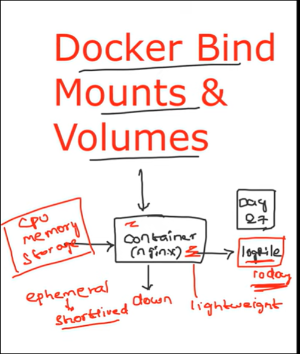
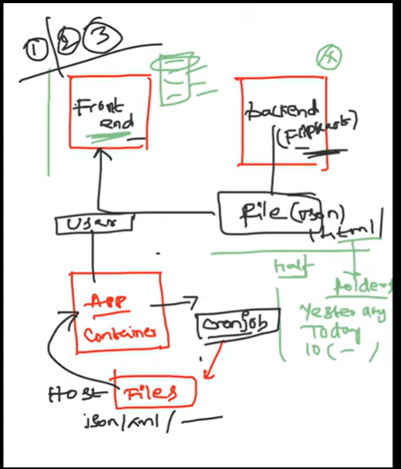
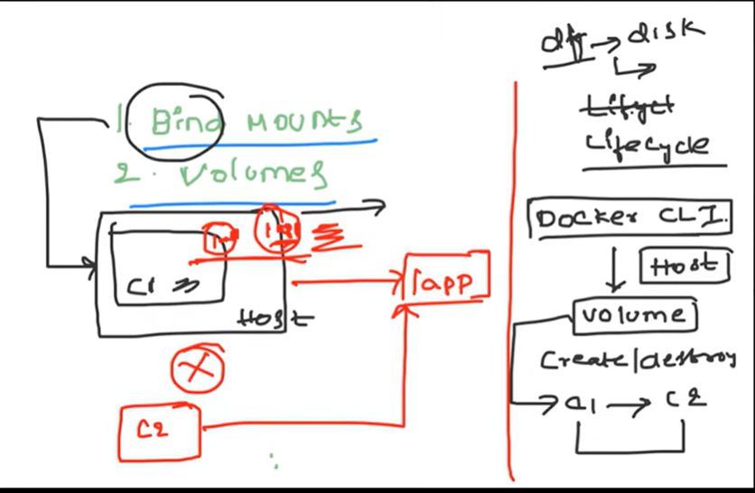
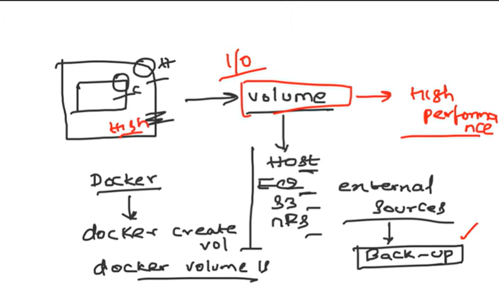
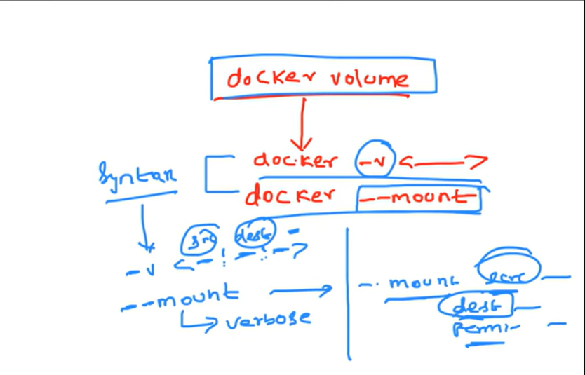
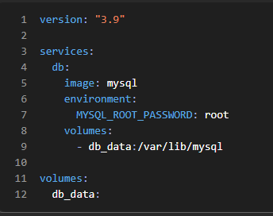

# Docker Volumes

## Problem Statement

It is a very common requirement to persist the data in a Docker container beyond the lifetime of the container. However, the file system
of a Docker container is deleted/removed when the container dies. 

## Solution

There are 2 different ways how docker solves this problem.

1. Volumes
2. Bind Directory on a host as a Mount

### Volumes 

Volumes aims to solve the same problem by providing a way to store data on the host file system, separate from the container's file system, 
so that the data can persist even if the container is deleted and recreated.


Volumes can be created and managed using the docker volume command. You can create a new volume using the following command:

```
docker volume create <volume_name>
```

Once a volume is created, you can mount it to a container using the -v or --mount option when running a docker run command. 

For example:

```
docker run -it -v <volume_name>:/data <image_name> /bin/bash
```

This command will mount the volume <volume_name> to the /data directory in the container. Any data written to the /data directory
inside the container will be persisted in the volume on the host file system.

### Bind Directory on a host as a Mount

Bind mounts also aims to solve the same problem but in a complete different way.

Using this way, user can mount a directory from the host file system into a container. Bind mounts have the same behavior as volumes, but
are specified using a host path instead of a volume name. 

For example, 

```
docker run -it -v <host_path>:<container_path> <image_name> /bin/bash
```

## Key Differences between Volumes and Bind Directory on a host as a Mount

Volumes are managed, created, mounted and deleted using the Docker API. However, Volumes are more flexible than bind mounts, as 
they can be managed and backed up separately from the host file system, and can be moved between containers and hosts.

In a nutshell, Bind Directory on a host as a Mount are appropriate for simple use cases where you need to mount a directory from the host file system into
a container, while volumes are better suited for more complex use cases where you need more control over the data being persisted
in the container.


## Concept images












## Points to be remembered
- **We may notice these two types of commands docker -v <...> and docker --mount <......>:** Actually these two are same only the syntax is difference when we use -v it is straight forward src and dest parameters, But when we use --mount we can provide more details (verbose) example src, dest, permisions etc...

- To acheive persistant data in docker conatiner we can use Volumes or bind mount options both will work but alway try to follow volume option because of its own advantages

- **Advantages of creating volumes instead of bind mounts:**  Docker volumes are fully managed by Docker, stored in Docker’s internal storage, independent of host paths, portable across environments, safer, easier to back up, better performing (especially on Docker Desktop), and ideal for production use cases such as databases, whereas bind mounts map host directories directly into containers, are useful for local development with live code syncing, but are host‑dependent, less portable, and risky for production; Docker Compose simplifies volume management by defining named volumes declaratively, containers should always be stateless with all state externalized, named volumes are preferred over anonymous ones, bind mounts should generally be avoided in production, docker inspect can be used to verify mounts, and the key takeaway is that containers are disposable but data is not, so state should always live in Docker volumes or external storage systems.

--------------------------------------------------

### DOCKER VOLUME COMMANDS (WITH EXPLANATION)

**docker volume create my_volume**  
Creates a new named Docker volume called my_volume.


**docker volume ls**  
Lists all Docker volumes available on the system.


**docker volume inspect my_volume**  
Displays detailed information about the volume including mount location.


**docker volume rm my_volume**  
Removes a specific Docker volume that is not in use.


**docker volume prune**  
Removes all unused Docker volumes to free disk space.

--------------------------------------------------

#### USING VOLUMES WITH CONTAINERS

**docker run -v my_volume:/app/data nginx**  
Mounts the volume to the container directory.


**docker run --mount type=volume,src=my_volume,dst=/app/data nginx**  
Same as above but with explicit syntax.

--------------------------------------------------

#### DOCKER BIND MOUNTS

**docker run -v /host/path:/container/path nginx**  
Maps a host directory into the container.


**docker run --mount type=bind,src=/host/path,dst=/container/path nginx**  
Bind mount using explicit syntax.

--------------------------------------------------

#### DOCKER COMPOSE WITH VOLUMES



--------------------------------------------------

#### FINAL TAKEAWAY  
Containers are disposable, but data is not. Always use volumes for persistence.